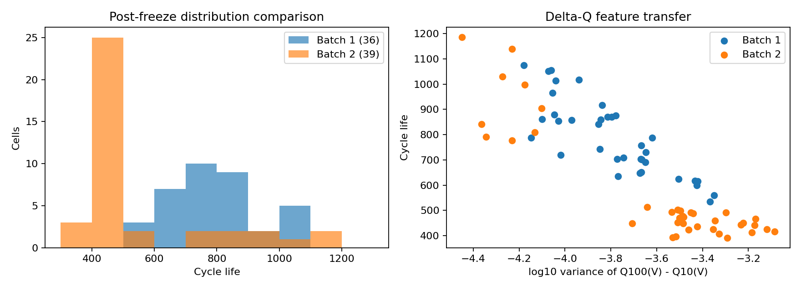
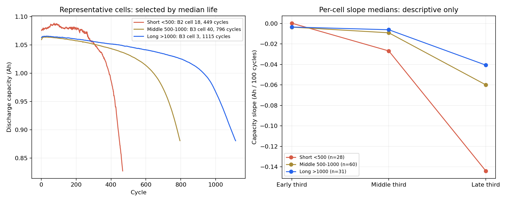
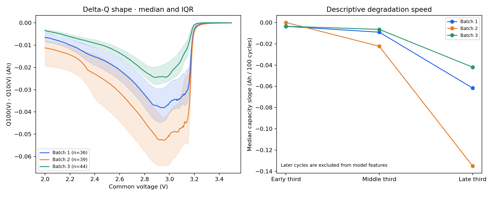
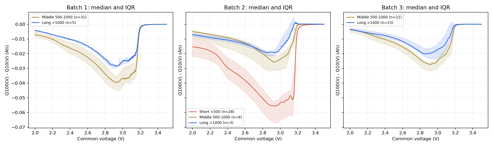
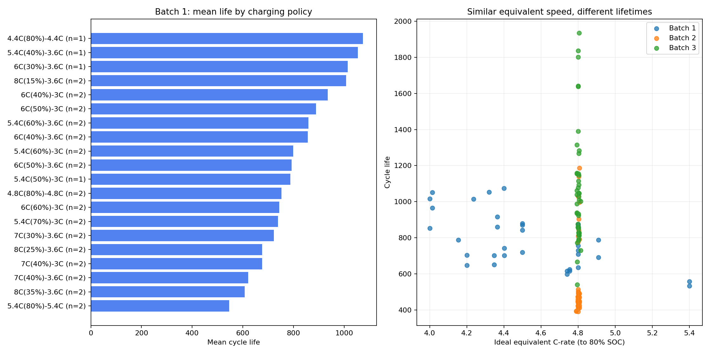
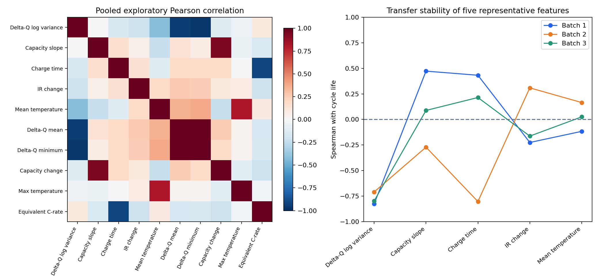
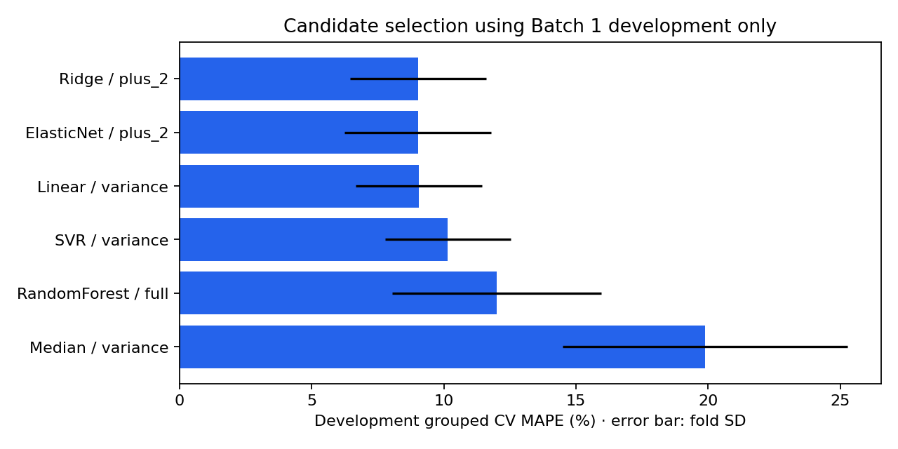
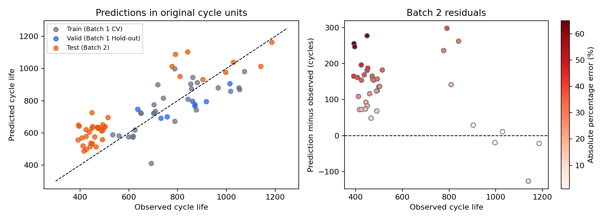

# ESS 배터리 수명 예측

초기 100사이클 데이터로 총 Cycle Life를 예측하고 **Batch 1 학습 → Batch 2 평가**로 배치 간 일반화를 확인합니다. EDA 근거와 모델 구현, 성능·오류·ESS 해석을 연결합니다.

## 프로젝트 개요

- 데이터셋: MIT–Stanford Battery Dataset 계열 (Severson et al., 2019)
- 태스크: **Regression**; `log10(cycle_life)` 학습 후 사이클 단위 복원
- 학습: Batch 1 (`2017-05-12`), 46 → 36셀; 개발 29 / 정책 Hold-out 7
- 평가: Batch 2 (`2018-02-20`), 47 → 39셀; 추가 Batch 3 (`2018-04-12`), 46 → 44셀
- 최종 모델: **Ridge**, 피처 `log10_dq_variance, charge_time_mean_2_6`, `alpha=0.1`
- [상세 분석·직접 실행 노트북](DAY2/03_modeling.ipynb)

## 파일 구조

```text
├── archive/                    # 원본 MAT (Git 제외)
├── data/README.md              # 데이터·제외 기준
├── DAY1/                       # 기존 모델 전략 보고서
├── DAY2/
│   ├── 03_modeling.ipynb
│   └── results/                # 성능·CV·피처·audit·오류·그래프·모델
├── src/
│   ├── preprocess.py
│   ├── features.py
│   ├── train.py
│   ├── diagnostics.py
│   ├── report.py / evidence.py
│   └── verify_results.py
├── requirements.txt
└── README.md
```

## 환경 설정

Python 3.11 환경에서 프로젝트 루트 기준으로 실행합니다. 원본 MAT를 [데이터 안내](data/README.md)의 경로에 둡니다.

```bash
git clone https://github.com/chyj1022/DS-MINI-Develop-U104.git
cd DS-MINI-Develop-U104
python3 -m venv .venv
source .venv/bin/activate
pip install -r requirements.txt
python -m src.train --batch3
python -m src.verify_results
```

필수 Batch 1/2만 실행하려면 `--batch3`를 생략합니다. 저장 모델의 추가 진단만 실행하려면 `python -m src.diagnostics --batch3`를 사용합니다. 노트북 커널은 패키지를 설치한 환경을 선택합니다. 실행 Python 3.11.15, scikit-learn 1.6.1; 원본 SHA-256·파일 크기·환경·고정 모델 해시는 `provenance.json`에 기록합니다.

대용량 원본 `archive/`, 가상환경 `.venv/`, 저장 모델 `*.joblib`는 Git 업로드에서 제외합니다. 공개된 CSV·그림·실행 결과는 바로 열람할 수 있고, 원본부터 재학습하거나 저장 모델을 재생성하려면 위의 MAT 파일과 환경이 필요합니다. 상세 분석의 재현 기준은 DAY 2 노트북이며 기존 통합 EDA는 선행 탐색 기록입니다.

## EDA

DAY 1과 같은 **단수명 <500회 / 중간 500~1,000회 / 장수명 >1,000회** 기준을 유지합니다. 분모는 모델링에 사용할 유효 라벨 셀이며 알려진 불완전·결측 라벨은 제외했습니다. 그룹이 없는 배치는 0셀로 표시하고 경계를 바꾸어 채우지 않습니다. 이 그룹은 설명·오류 분석용이며 회귀 입력이나 분류 모델의 학습 라벨이 아닙니다.

### 1. Cycle Life 분포

수명 통계의 단위는 사이클 수입니다.

| Batch | 유효 셀 수 | 최소 | 중앙값 | 평균 | 표준편차 | 최대 |
| --- | --- | --- | --- | --- | --- | --- |
| 1 | 36 | 534.000 | 772.500 | 788.417 | 148.696 | 1074.000 |
| 2 | 39 | 392.000 | 472.000 | 565.744 | 222.202 | 1186.000 |
| 3 | 44 | 541.000 | 1005.500 | 1059.659 | 313.870 | 1935.000 |

| Batch | 분모 (셀) | 단수명 <500 | 중간 500~1,000 | 장수명 >1,000 |
| --- | --- | --- | --- | --- |
| 1 | 36 | 0셀 (0.0%) | 31셀 (86.1%) | 5셀 (13.9%) |
| 2 | 39 | 28셀 (71.8%) | 8셀 (20.5%) | 3셀 (7.7%) |
| 3 | 44 | 0셀 (0.0%) | 21셀 (47.7%) | 23셀 (52.3%) |



Batch 1은 중간 수명에 집중되고 <500회 셀이 없습니다. Batch 2는 28/39셀(71.8%)이 <500회이고 소수의 긴 수명 셀 때문에 오른쪽 꼬리가 나타납니다. Batch 3은 더 넓은 범위로 분포하며 장수명 비중이 큽니다. 위 Batch 2 그래프는 고정 모델 평가 후의 사후 진단으로 후보 선택에 사용하지 않았습니다.

**핵심 발견:** 학습 배치에 없는 단수명 구간이 외부 Batch 2의 대부분을 차지하므로 단수명 개발 데이터 확보와 배치 간 일반화 검증이 중요합니다.

### 2. 열화 곡선 분석



왼쪽은 수명순으로 정렬한 각 그룹의 아래쪽 중앙 셀을 선택한 실제 곡선입니다. 곡선 모양을 보고 대표 셀을 고르지 않았습니다. 단수명 <500: Batch 2 셀 18, 449회 / 중간 500~1,000: Batch 3 셀 40, 796회 / 장수명 >1,000: Batch 3 셀 3, 1115회. 오른쪽과 아래 표는 셀별 관측 기간을 3등분한 기울기의 그룹 중앙값으로 **Ah/100사이클** 단위입니다. 대표 셀 곡선과 전체 그룹 요약은 구분합니다.

| 수명 그룹 | 셀 수 | 초기 기울기 | 중기 기울기 | 말기 기울기 |
| --- | --- | --- | --- | --- |
| 단수명 <500 | 28 | 0.000 | -0.027 | -0.144 |
| 중간 500~1,000 | 60 | -0.004 | -0.009 | -0.060 |
| 장수명 >1,000 | 31 | -0.003 | -0.006 | -0.041 |

단수명 말기 감소 속도의 절댓값은 장수명의 약 **3.54배**입니다. 통합 그룹 비교에서 관측된 차이이며 단수명 28셀이 모두 Batch 2여서 수명·배치 효과를 분리할 수 없습니다. 초기·중기·말기는 같은 절대 사이클 구간이 아니라 각 셀의 기록 진행률 구간입니다.

#### Knee point 존재 여부와 시점

100회 이후 용량에 연속 구간선형 모델을 적합하고 관측 기간의 20~80% 범위에서 knee 후보를 탐색했습니다. 후반 기울기가 음수이고 이전보다 감소가 빠르며 크기가 2배 이상인 경우를 형태 조건으로 표시했습니다. 총 119셀 중 118셀이 조건을 충족했지만 **33셀은 탐색 경계**에 걸렸습니다. 아래 시점은 경계에 걸리지 않고 형태 조건을 충족한 후보만의 요약입니다.

| 수명 그룹 | 셀 수 | 탐색 경계 후보 | 내부·형태 조건 충족 | 후보 범위 (회) | 후보 중앙값 (회) | 수명 대비 시점 중앙값 |
| --- | --- | --- | --- | --- | --- | --- |
| 단수명 <500 | 28 | 4 | 24 | 313.2~406.2 | 363.285 | 80.7% |
| 중간 500~1,000 | 60 | 17 | 42 | 387.5~783.1 | 614.363 | 76.5% |
| 장수명 >1,000 | 31 | 12 | 19 | 759.3~1532.9 | 907.719 | 78.5% |

**핵심 발견:** 장·단수명 모두 후반 열화 가속이 관측되며 단수명 그룹의 말기 감소가 더 가파릅니다. Knee 후보 시점은 셀마다 달라지고 경계 후보가 있어 정확한 열화 시작점의 확정으로 해석하지 않습니다. 전체 곡선·말기 기울기·knee는 미래 관측 설명용으로 모델 입력에서 제외합니다.

### 3. ΔQ(V) 곡선 분석

`ΔQ(V) = Q100(V) − Q10(V)`를 공통 2.0~3.5V·1,000점 전압축에서 계산했습니다. 배치별 곡선의 중앙값과 IQR은 다음과 같습니다.





두 번째 그림은 배치마다 장·중간·단수명 곡선을 비교합니다. Batch 1·3의 단수명 그룹은 실제로 없으므로 그리지 않습니다. 음영은 셀 간 IQR로 평균의 신뢰구간이 아닙니다.

| Batch | 수명 그룹 | 셀 수 | log10 ΔQ 분산 중앙값 | ΔQ 최솟값 중앙값 (Ah) |
| --- | --- | --- | --- | --- |
| 1 | 단수명 <500 | 0 | — | — |
| 1 | 중간 500~1,000 | 31 | -3.769 | -0.039 |
| 1 | 장수명 >1,000 | 5 | -4.059 | -0.029 |
| 2 | 단수명 <500 | 28 | -3.446 | -0.056 |
| 2 | 중간 500~1,000 | 8 | -4.153 | -0.027 |
| 2 | 장수명 >1,000 | 3 | -4.272 | -0.019 |
| 3 | 단수명 <500 | 0 | — | — |
| 3 | 중간 500~1,000 | 21 | -4.092 | -0.028 |
| 3 | 장수명 >1,000 | 23 | -4.317 | -0.020 |

같은 Batch 2에서 단수명 28셀의 log 분산 중앙값은 -3.446, 장수명 3셀은 -4.272입니다. 단수명에서 곡선 변화의 크기가 더 크지만 장수명 표본이 3셀뿐이므로 일반화에 주의합니다. Batch 1의 ΔQ log 분산–log 수명 Pearson은 −0.844입니다.

**핵심 발견:** 초기 총 용량에서 뚜렷하지 않은 변화가 ΔQ 곡선에 드러나므로 log 분산을 핵심 피처로 구현했습니다. 분산은 곡선의 상수 원점 이동에 불변이지만 평균·최솟값은 그렇지 않아, 배치 간 원점·절차 차이를 모두 교정했다고 해석하지 않습니다. 단수명·장수명 곡선 차이가 화학적 원인이나 예측 정확도를 직접 입증하지도 않습니다.

### 4. 충전 속도(C-rate)와 수명의 관계



첫 그림과 아래 표는 **학습 Batch 1의 모든 충전 프로토콜**을 셀 수와 함께 비교합니다. 두 단계 정책은 80% SOC까지의 이상적 충전 시간을 환산한 등가 C-rate로 요약했으며 실제 측정 충전 시간과는 다릅니다. 전체 배치의 프로토콜별 평균·중앙값은 [policy_summary.csv](DAY2/results/policy_summary.csv)에 있습니다.

| Batch 1 충전 프로토콜 | 셀 수 | 등가 C-rate | 평균 수명 (회) |
| --- | --- | --- | --- |
| 4.4C(80%)-4.4C | 1 | 4.400 | 1074.000 |
| 5.4C(40%)-3.6C | 1 | 4.320 | 1054.000 |
| 6C(30%)-3.6C | 1 | 4.235 | 1014.000 |
| 8C(15%)-3.6C | 2 | 4.014 | 1008.500 |
| 6C(40%)-3C | 2 | 4.000 | 935.500 |
| 6C(50%)-3C | 2 | 4.364 | 888.500 |
| 5.4C(60%)-3.6C | 2 | 4.800 | 859.500 |
| 6C(40%)-3.6C | 2 | 4.500 | 856.000 |
| 5.4C(60%)-3C | 2 | 4.500 | 799.500 |
| 6C(50%)-3.6C | 2 | 4.800 | 792.500 |
| 5.4C(50%)-3C | 1 | 4.154 | 788.000 |
| 4.8C(80%)-4.8C | 2 | 4.800 | 753.000 |
| 6C(60%)-3C | 2 | 4.800 | 744.000 |
| 5.4C(70%)-3C | 2 | 4.909 | 739.500 |
| 7C(30%)-3.6C | 2 | 4.402 | 722.500 |
| 8C(25%)-3.6C | 2 | 4.347 | 676.500 |
| 7C(40%)-3C | 2 | 4.200 | 676.000 |
| 7C(40%)-3.6C | 2 | 4.755 | 621.000 |
| 8C(35%)-3.6C | 2 | 4.741 | 607.500 |
| 5.4C(80%)-5.4C | 2 | 5.400 | 546.500 |

| Batch | 셀 수 | 최소 C-rate | 최대 C-rate | Spearman (원 계산) | Spearman (동률 보정) |
| --- | --- | --- | --- | --- | --- |
| 1 | 36 | 4.000 | 5.400 | -0.435 | -0.436 |
| 2 | 39 | 4.790 | 4.807 | 0.321 | 0.353 |
| 3 | 44 | 4.794 | 4.813 | -0.132 | -0.132 |

표의 동률 보정은 부동소수점 계산의 미세한 차이로 같은 C-rate의 순위가 달라지는 것을 막기 위해 소수 8자리로 반올림한 민감도 비교입니다. Batch 2·3의 등가 C-rate는 거의 4.8C에 집중되어 있어 상관 부호만으로 속도 효과가 뒤집혔다고 해석하기 어렵습니다.

**핵심 발견:** Batch 1에서 등가 C-rate–수명 Spearman은 약 −0.44이지만 거의 같은 등가 속도에서도 프로토콜과 배치별 수명이 다릅니다. 속도 하나로 수명을 설명하거나 빠른 충전의 인과 효과를 확정할 수 없습니다. Batch 1 프로토콜별 1~2셀의 평균 차이는 통계적 유의성을 입증한 결과가 아니며, 같은 정책이 train·valid에 겹치지 않도록 정책 단위로 검증했습니다.

### 5. 추가 확인: 피처 중복·전이 안정성과 품질



ΔQ 요약값 사이의 중복이 크고 보조 피처는 배치별 상관 부호가 달라질 수 있습니다. Batch 1 전체 10개 피처 최대 VIF 290.43를 대표 5개로 줄이면 2.74입니다. 통합 상관행렬은 탐색용이며 실제 후보 선택은 Batch 1 개발 CV로 제한합니다. 상관 변화 자체를 오차의 인과 원인으로 단정하지 않습니다.

**핵심 발견:** 중복 피처를 줄이고 포함·제외 비교와 정규화를 사용하되 실제 예측 개선은 CV로 검증해야 합니다. IR 0 이하·비유한 값과 초기 용량 범위 이상을 점검하고 제외·대치 기준과 유효 표본 수를 기록했습니다. 상세 계산은 `eda_distribution.csv`, `life_group_statistics.csv`, `knee_timing_summary.csv`, `eda_vif.csv`, `cell_audit_all.csv` 및 [DAY 2 노트북](DAY2/03_modeling.ipynb)에 있습니다. [기존 통합 EDA](30-ESSHealth-scratch.ipynb)는 DAY 1 탐색 기록입니다.

### EDA → 모델 전략 연결

| 관측 근거 | 모델 설계·구현 | 검증 근거 |
| --- | --- | --- |
| 연속 수명과 초기 ΔQ 신호 | 총수명 회귀·ΔQ log 분산 핵심 입력 | 단일 피처 기준선 및 후보 CV 비교 |
| 후반 열화와 knee는 미래 관측 | 100회 이내 피처만 사용 | 미래 사이클 값을 바꾸어도 피처가 같은지 검사 |
| ΔQ 요약값의 중복 | 대표 5개 피처의 16개 부분집합 비교 | `feature_ablation.csv`, 학습 배치 VIF |
| 보조 피처의 배치별 상관 변화 | 포함·제외 효과를 Batch 1에서 비교 | `paired_ablation.csv`, 피처별 배치 상관 |
| 작은 표본과 정책별 실험 | 정규화 선형 모델·정책별 분할 | Nested-CV 및 정책 Hold-out |
| Batch 1의 단수명 부재 | 외부 배치의 과대예측 편향 점검 | Batch 2 기준선·부호 오차·수명 구간 분석 |


## Modeling

### 피처 엔지니어링 전략

ΔQ log 분산을 고정하고 초기 용량 기울기·충전 시간·IR 변화·평균 온도를 포함/제외한 **16개 부분집합**을 비교했습니다. 용량 기울기는 `0<Qd≤1.2Ah` 값으로 적합하며 결측 대치·표준화는 학습 fold 안에서만 수행합니다. 셀 ID·수명·기록 길이·최종 용량·후반 knee는 입력에서 제외합니다.

| 피처 | 의미 | 관측 구간 | 단위 | 최종 선택 |
| --- | --- | --- | --- | --- |
| log10_dq_variance | ΔQ(V) 변화 분산의 log10 | 100회 − 10회 | log10(Ah²) | 선택 |
| qd_slope_2_100 | 방전 용량 기울기 | 2~100회 | Ah/cycle | 후보 비교 |
| charge_time_mean_2_6 | 초기 평균 충전 시간 | 2~6회 | min | 선택 |
| ir_change_100_2 | 내부저항 변화량 | 100회 − 2회 | Ω | 후보 비교 |
| tavg_mean_2_100 | 초기 평균 온도 | 2~100회 | °C | 후보 비교 |

핵심 피처는 `log10 Var(Q100(V) − Q10(V))`입니다. 충전 시간은 2~6회의 유한한 양수 값 평균, 용량 기울기는 2~100회 유효 용량에 대한 선형 적합, IR 변화는 양수인 100회 값−2회 값, 온도는 2~100회 유한 값 평균으로 구현했습니다. 전압축의 단조성·2.0~3.5V 범위·1,000개 공통 점을 확인합니다. 최종 입력과 품질 진단용 플래그는 구분합니다.

### 개발 파이프라인과 누수 방지

| 단계 | 수행 내용 | 확인할 파일 |
| --- | --- | --- |
| 원본·품질 검사 | 불완전·결측 타깃 제외 및 셀별 이유 기록 | `src/preprocess.py`, `cell_audit_all.csv` |
| 초기 피처 추출 | 100사이클 이내 정보만 사용 | `src/features.py`, `feature_definitions.csv` |
| 정책 Hold-out | Batch 1 개발 29셀·16정책 / 검증 7셀·4정책 분리 | `split_manifest.csv` |
| Nested-CV | 외부 4-fold 검증, 각 외부 학습 fold 안에서 내부 4-fold 후보 선택 | `nested_cv_folds.csv`, `cv_fold_manifest.csv` |
| 최종 후보 선택 | 개발 29셀의 정책별 CV MAPE로 설정 선택 | `cv_results.csv`, `frozen_config.json` |
| Hold-out 평가 | 개발 29셀에만 적합한 모델로 검증 7셀 평가 | `metrics.csv` |
| 외부 배치 평가 | 설정 고정 후 Batch 1 전체 36셀 재학습, Batch 2·3 평가 | `predictions_all.csv`, `metrics_all.csv` |

셀 단위 분리만으로 동일 정책의 중복이 자동으로 차단되지는 않으므로, **동일 충전 정책이 개발·Hold-out 및 CV train·valid를 가로지르지 않도록** 분리합니다. 결측 중앙값과 표준화 통계도 각 학습 fold에서만 적합합니다. Hold-out 및 외부 배치 점수는 후보 선택에 사용하지 않았습니다. 선행 EDA에서 평가 배치를 확인했다는 한계는 별도로 보고합니다.

### 모델 선택 및 근거

중앙값·단일 피처 Linear·Ridge·Elastic Net·제한된 RBF SVR/Random Forest, 원 단위 타깃 대안을 포함한 **212조합**을 개발 29셀의 정책별 4-fold CV에서 비교했습니다. Ridge가 최저 CV(9.02417%)로 선택됐지만 단일 ΔQ 피처 후보(9.02586%)와 차이는 **0.00169%p**로 작습니다. 충전 시간의 실질적 개선을 주장하지 않으며 다음 개발 실험에서 선택 근거를 재검토하고 단순 모델을 우선 비교합니다. 현재 시험 결과로 모델을 바꾸지 않았습니다.

과제의 Train은 **개발 Nested-CV**(nested 4×4 GroupKFold)의 외부 fold 검증오차 평균이며 학습 오차가 아닙니다. Valid는 별도 7셀 Hold-out입니다. 설정 고정 후 전체 Batch 1 **36셀**로 재학습해 Batch 2·3를 평가했습니다. 같은 정책이 개발·검증에 걸치지 않습니다. 피처 추가 효과는 `paired_ablation.csv`에서 같은 alpha·같은 fold로 비교합니다.

### 후보 모델 비교



각 막대는 해당 모델군에서 선택된 최저 후보의 개발 CV MAPE이며 오차 막대는 **fold 간 표준편차**입니다. 성능 리포팅의 Nested-CV와는 별도입니다. Ridge·Elastic Net·Linear의 성능이 비슷해 작은 점수 차이를 우월성의 강한 근거로 보지 않습니다. `plus_2`는 ΔQ log 분산과 초기 충전 시간 조합입니다.

## 성능 결과

### 필수 평가: Regression (Batch 1 → Batch 2)

| 구분 | MAPE (%) | 비고 |
| --- | --- | --- |
| Train (Batch 1 CV) | 10.842 | 개발 Nested-CV (29셀); 외부 fold 검증오차 평균 |
| Valid (Batch 1 Hold-out) | 10.435 | 정책 분리 7셀; 개발 29셀로 학습 |
| Test (Batch 2) | 28.609 | Batch 1 36셀로 재학습한 고정 모델; 39셀 평가 |
| Gap (Train-Valid) | -0.407 | Valid − Train; (+): 오차 증가, 과적합 가능성 |
| Gap (Valid-Test) | 18.174 | Test − Valid; (+): 배치 간 일반화 저하 가능성 |
| Gap (Target-Test) | 19.509 | Test − 9.1%; 과제 Target 대비 참고 비교 |

행 이름을 유지하되 **Gap (Train-Valid)은 Valid − Train으로 계산**합니다. Gap (Valid-Test)은 Test − Valid, Gap (Target-Test)은 Test − 9.1, Gap (Batch2-Batch3)은 Batch 3 − Batch 2이며 단위는 **%p**입니다.

MAPE=`100 × mean(|실제−예측|/실제)`. 필수 6행은 `model_performance.csv`, 추가 배치 계산값은 `model_performance_with_batch3.csv`에 있습니다. 개발 Nested-CV 외부 fold는 **5.44~16.62%**로 변하고 Hold-out은 7셀뿐이므로, −0.407%p 차이를 안정성의 강한 증거로 삼기는 어렵습니다.


### 추가 평가: Batch 3 (과제 확장 양식)

| 구분 | 비교 항목 | MAPE (%) | 비고 |
| --- | --- | --- | --- |
| Train (Batch 1 CV) |  | 10.842 | 개발 Nested-CV (29셀); 외부 fold 검증오차 평균 |
| Valid (Batch 1 Hold-out) |  | 10.435 | 정책 분리 7셀; 개발 29셀로 학습 |
| Test (Batch 2) |  | 28.609 | Batch 1 36셀로 재학습한 고정 모델; 39셀 평가 |
|  | Gap (Train-Valid) | -0.407 | Valid − Train; (+): 오차 증가, 과적합 가능성 |
|  | Gap (Valid-Test) | 18.174 | Test − Valid; (+): 배치 간 일반화 저하 가능성 |
|  | Gap (Target-Test) | 19.509 | Test − 9.1%; 과제 Target 대비 참고 비교 |
| Test (Batch 3) |  | 12.156 | 추가 44셀; 동일 Batch 1 고정 모델 |
|  | Gap (Batch2-Batch3) | -16.453 | Batch 3 − Batch 2; (+): Batch 3 오차 증가 |
|  | Gap (Target-Test) | 3.056 | Batch 3 − 9.1%; 동일 조건 재현 아님 |

Gap (Train-Valid)은 Valid − Train으로 계산합니다. Batch2-Batch3 Gap은 Batch 3 − Batch 2, 마지막 Target Gap은 Batch 3 − 9.1입니다. 단위는 %p이며 표의 두 Target Gap은 각각 Batch 2·Batch 3 결과에 해당합니다.

Batch 3 MAPE 12.156%는 Batch 2보다 16.453%p 낮습니다. 이번 결과는 모든 외부 배치가 동일하게 어렵다는 가정과 맞지 않으며, 짧은 수명에 집중된 Batch 2에서 모델이 더 취약함을 보여줍니다. 구조·정책·수명 분포가 함께 달라 원인을 하나로 단정하지 않습니다. 추가 양식의 계산 근거는 `model_performance_with_batch3_formatted.csv`에 저장합니다.

같은 Batch 2 39셀에서 **Batch 1 중앙값 772.5회 기준선 MAPE 58.73% → 모델 28.61%**로 상대 오차가 **51.29% 감소**했습니다. 예측 신호는 있지만 정확도에는 한계가 있습니다. [기준선 비교](DAY2/results/batch2_baseline_comparison.csv)는 학습 Batch 1로만 중앙값을 정하며 모델 선택에는 사용하지 않습니다.

| 모델 | 평가 셀 수 | MAPE (%) | MAE (회) |
| --- | --- | --- | --- |
| Batch 1 중앙값 고정 예측 | 39 | 58.728 | 284.782 |
| 고정 Ridge 모델 | 39 | 28.609 | 141.752 |

상대 감소율은 `100 × (1 − 모델 MAPE / 기준선 MAPE)`입니다. 논문과의 비교에 더해, 같은 외부 셀에서의 실질적 개선을 보여주는 단순 기준선 비교입니다.

Batch 2는 Target에 미달했습니다. 정책 단위 bootstrap(2,000회·seed=42)의 고정 모델 MAPE 95% 구간은 **22.05~35.61%**입니다. 재학습·미래 배치의 성능 보증이나 셀별 예측 구간은 아닙니다.

원논문은 `2017-05-12`·`2017-06-30` 혼합 분할이고 과제는 `2018-02-20` 외부 배치 평가여서 **Target Gap은 참고 비교**입니다. 선행 EDA가 세 배치를 봤다는 한계가 있으며, 모델 선택·계수 추정은 Batch 1에 제한했습니다. Valid 모델 29셀·Test 모델 36셀의 학습 규모 차이도 Gap에 포함됩니다. [저자 분할 코드](https://github.com/rdbraatz/data-driven-prediction-of-battery-cycle-life-before-capacity-degradation/blob/master/LoadData.m).

## 오류 분석

### 실제값·예측값과 Batch 2 잔차



왼쪽의 대각선은 실제값과 예측값이 같은 기준선입니다. Train 점은 개발 Nested-CV의 외부 fold 예측으로 학습 적합값이 아닙니다. 오른쪽에서 잔차(예측−실제)가 0보다 크면 과대예측입니다. 짧은 수명의 Batch 2 셀에서 양의 잔차가 반복되어 **일부 큰 오차보다 넓게 나타나는 과대예측 편향**을 확인할 수 있습니다.

- Batch 2 **39셀 중 36셀**을 과대예측했습니다. 평균 부호 오차(예측−실제)는 **+133.1회**, 오차율 중앙값은 **30.41%**로 일부 이상치만의 문제가 아닙니다.
- Batch 1 최소 수명보다 짧은 **30셀 모두 과대예측**됐고 MAE와 평균 부호 오차는 146.1회입니다. `standard_structure`와 `below_batch1_life_min`은 정확히 같은 30셀로, 두 결과는 독립적인 원인 증거가 아닙니다. 구조와 수명 범위의 효과를 분리해 주장하지 않습니다.
- 입력 범위 안 22셀의 MAPE 34.30%가 범위 밖 17셀 21.25%보다 높습니다. **입력 범위 이탈만으로 성능 저하를 설명할 수 없으며** 피처–수명 관계·정책·배치 효과를 함께 봐야 합니다.
- Batch 3 전체 44셀 12.16%, 저자 품질 규칙을 적용한 40셀 11.43%를 함께 보고했습니다. 개선은 단수명 개발 표본 확보·현장 조건 검증을 우선하며 변경 모델은 새 미사용 배치로 평가해야 합니다.

셀별 근거: `error_analysis.csv`, `prediction_bias.csv`, `subgroup_overlap.csv`, `input_domain_audit.csv`, `domain_metrics.csv`. 표본 수만으로 원인을 설명하기보다 학습 수명 범위·배치 분포·피처–수명 관계를 우선 점검합니다. 추가 Batch 3의 곡선 정렬·원점 불변성·품질 민감도와 반례 해석은 [노트북](DAY2/03_modeling.ipynb)에 있습니다.

### 오차율 상위 5셀

| 셀 ID | 실제 수명 | 예측 수명 | 예측−실제 (회) | 오차율 (%) |
| --- | --- | --- | --- | --- |
| 6 | 393.000 | 648.585 | 255.585 | 65.034 |
| 15 | 396.000 | 642.824 | 246.824 | 62.329 |
| 18 | 449.000 | 726.432 | 277.432 | 61.789 |
| 2 | 424.000 | 620.207 | 196.207 | 46.275 |
| 19 | 392.000 | 556.893 | 164.893 | 42.064 |

다섯 셀은 모두 실제 수명 500회 미만이며 과대예측됐습니다. 전체 39셀의 부호 오차와 함께 보아야 하며, 이 셀들을 제거해서 성능을 개선하지 않았습니다. 다음 실험은 단수명 개발 표본 확보, 단일 ΔQ 피처와 충전 시간 조합 재비교, 신규 배치 검증을 우선합니다.

## ESS 도메인 해석

셀 선별·점검 우선순위·교체 예산의 보조 지표로 활용할 수 있습니다. 짧은 수명 과대예측은 교체 지연 위험으로 이어집니다. 실험실 단일 셀·36셀 학습·특정 충전 조건에 한정돼 현장 달력 열화·온도·부분 충방전·셀 불균형, 제조 배치와 셀별 예측 구간의 추가 검증이 필요합니다.

동일 배치에서는 약 10% 검증 오차를 얻었지만, 단수명 셀이 많은 외부 Batch 2에서 과대예측 편향과 일반화 한계를 확인했습니다. 현재 모델은 교체 시점의 단독 결정 근거로 사용하기 어렵습니다.

| 의사결정 | 활용 | 추가 조건 |
| --- | --- | --- |
| 셀 선별·점검 우선순위 | 초기 신호로 상대 수명 비교 | 같은 화학계·현장 운전 조건 검증 |
| 교체 예산·정비 계획 | 총수명과 과대예측 위험 참고 | 셀별 예측 구간·보수적 기준·실제 SOH |
| 충전 운영 검토 | 정책별 오차·신규 정책 감시 | 관측 상관을 최적 C-rate의 인과 근거로 쓰지 않음 |

예측 대상은 **총 Cycle Life**로 현재 잔여 수명(RUL)이나 안전 사고 확률이 아닙니다. 실 배포를 위해 현장 라벨 확보와 제조 배치·운전 조건별 검증, 셀별 예측 구간, 신규 정책 및 입력 분포의 감시 기준이 필요합니다. 관측된 C-rate 상관을 최적 충전 정책의 인과 근거로 사용하지 않습니다.

## 평가항목별 확인 위치

| 평가항목 | 배점 | 직접 근거 | 산출물 |
| --- | --- | --- | --- |
| EDA | 50 | 분포·열화·ΔQ·정책·상관·VIF를 원본 재계산 | eda_distribution / degradation_evidence / eda_correlations / eda_vif |
| EDA → 전략 연결성 | 30 | 관측→시사점→설계→코드→검증 연결표 | 노트북 1~3절 |
| 모델링 전략 수립 | 20 | 회귀·정규화·212후보·기준선·개선 불확실성 | cv_results / feature_ablation / paired_ablation |
| 전략 → 구현 반영 | 20 | 100회 이내 피처·타깃 변환·실제 선택 모델 | features.py / model_coefficients / 노트북 직접 추출 |
| Pipeline 개발 | 40 | 원본→정책 분리→fold 내부 전처리→선택→재학습→평가 | train.py / 직접 재현 셀 / provenance / verify_results.py |
| 성능 리포팅 및 해석 | 20 | 지정 형식·Gap 방향·동일 Batch 2 기준선·불확실성·조건 차이 | model_performance / batch2_baseline_comparison / metric_uncertainty |
| 분석 결과 해석 | 20 | 과대예측 편향·동일 하위집단 확인·입력 범위 반례·ESS 해석 | prediction_bias / subgroup_overlap / domain_metrics / ESS 의사결정표 |

배점은 과제 기준을 옮긴 것으로 자체 채점 점수가 아닙니다. 모델 전략 수립 100점·모델 개발 및 평가 100점의 각 근거를 README와 노트북, 결과 CSV에서 확인할 수 있습니다.

## 참고문헌

- Severson et al. (2019). Data-driven prediction of battery cycle life before capacity degradation. *Nature Energy*, 4, 383–391. [원논문](https://www.nature.com/articles/s41560-019-0356-8).

## 팀 구성

- 최유정(울산 3반 U104), **개인 수행**: EDA, 모델 전략 수립, 피처 엔지니어링, 파이프라인·모델 개발, Batch 2·3 성능 평가, 오류 분석 및 보고서 작성 전 과정.

평가항목별 근거는 노트북과 `assessment_evidence.csv`에서 확인할 수 있습니다. 자동 검증은 원본 피처·미래 정보 불변성·정책 분리·학습 전용 전처리·수치·모델·노트북 실행을 확인합니다.
